# Multi-view Structure from Motion in MATLAB

This project reconstructs sparse 3D scene geometry and camera poses from an ordered collection of calibrated photographs. It implements the main stages of a Structure-from-Motion (SfM) pipeline in MATLAB, using VLFeat for SIFT feature extraction and descriptor matching.

## What the project does

The reconstruction pipeline:

1. Loads the image sequence and constructs the intrinsic calibration matrix from image size and 35 mm-equivalent focal length.
2. Extracts SIFT keypoints and descriptors from every image with VLFeat.
3. Matches features between adjacent views.
4. Robustly estimates relative rotation with parallel RANSAC tests for an essential matrix and a homography. This helps handle both general 3D scenes and difficult, nearly planar scenes.
5. Converts relative rotations into absolute camera orientations.
6. Initializes a sparse 3D model from a selected image pair, chooses the physically valid essential-matrix decomposition by a chirality test, and triangulates points with DLT.
7. Refines the initial 3D points by minimizing two-view reprojection error with damped iterative updates.
8. Estimates each camera translation robustly from 2D–3D correspondences using a two-point RANSAC procedure, then refines the camera translation.
9. Triangulates matched points for all adjacent image pairs, removes distant outliers, and plots the combined point cloud together with the recovered camera poses.

The random-number generator is seeded (`rng(42)`) so that the RANSAC sampling is repeatable.

## Results

The input column shows one representative photograph from each dataset. The reconstruction column shows the recovered sparse point cloud; blue arrows indicate the estimated camera positions and viewing directions. The complete image sequences are available under [`data/`](data), and MATLAB figure files are available under [`plot/`](plot).

| Dataset | Representative input | Sparse reconstruction |
|---|---|---|
| 3 — Cathedral gate | 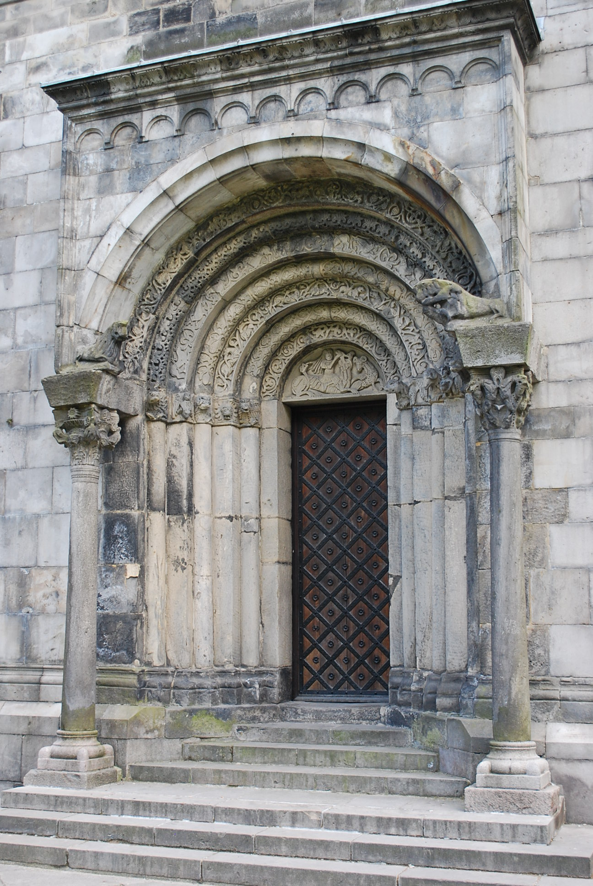 | 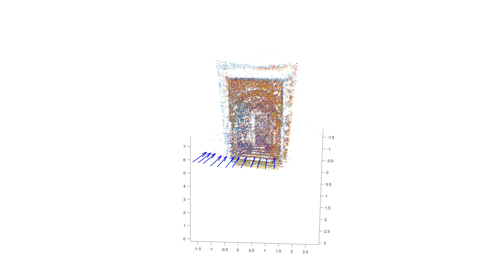 |
| 4 — Fountain | 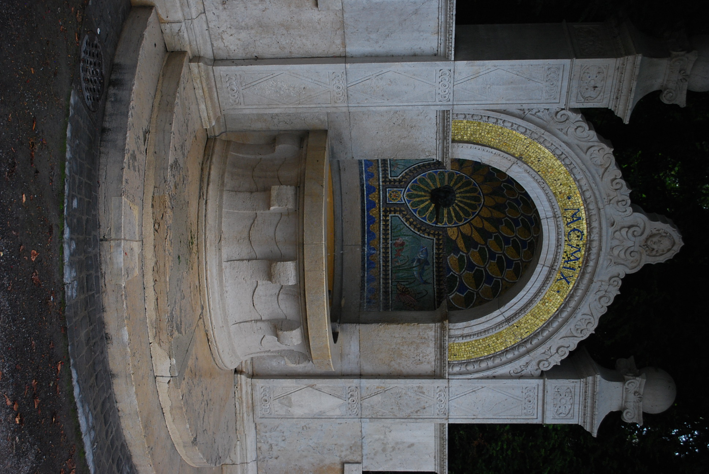 | 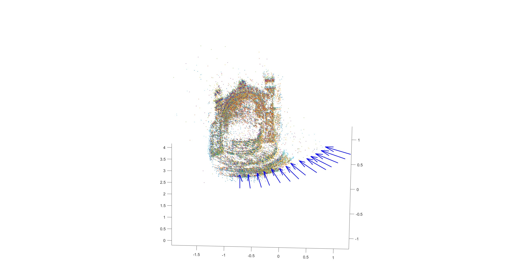 |
| 5 — Golden statue | 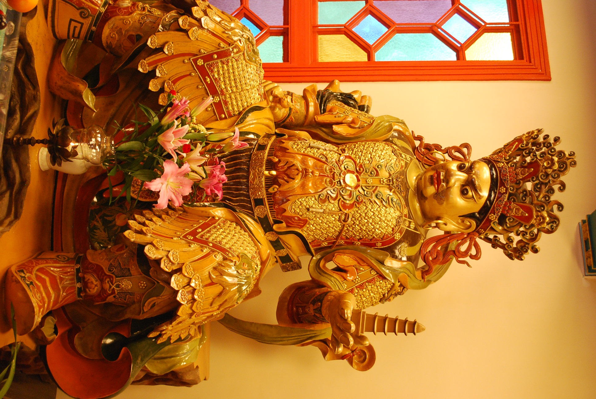 | 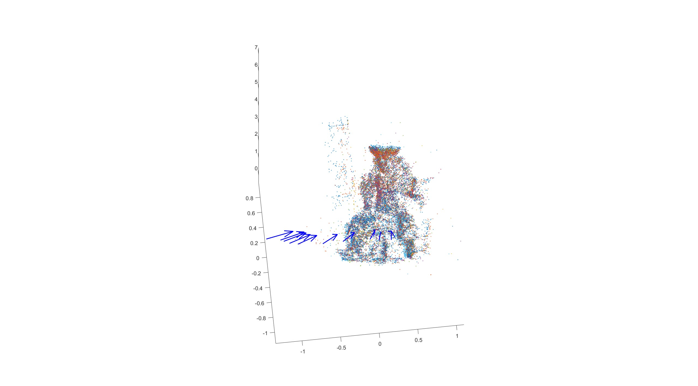 |
| 6 — Landhaus detail | 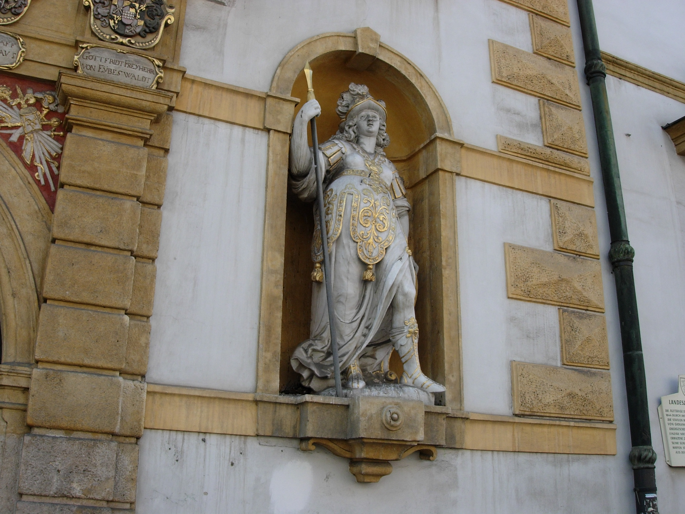 | 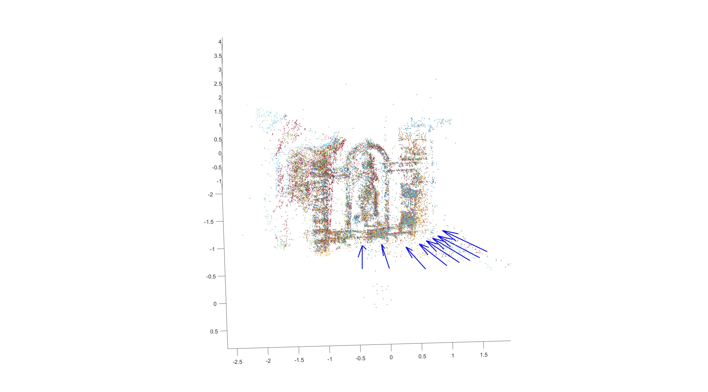 |
| 7 — Heidelberg building | 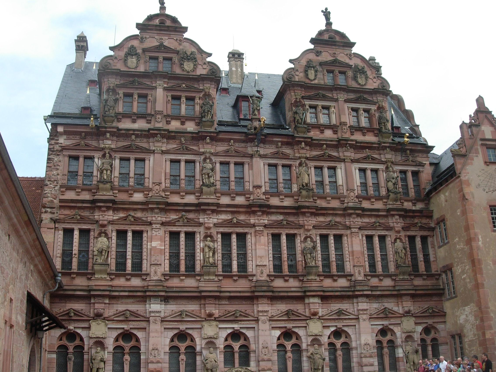 | 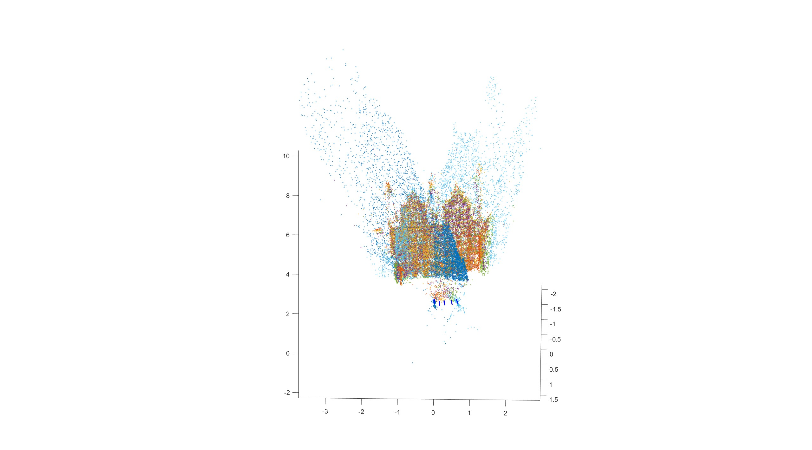 |
| 8 — Relief | 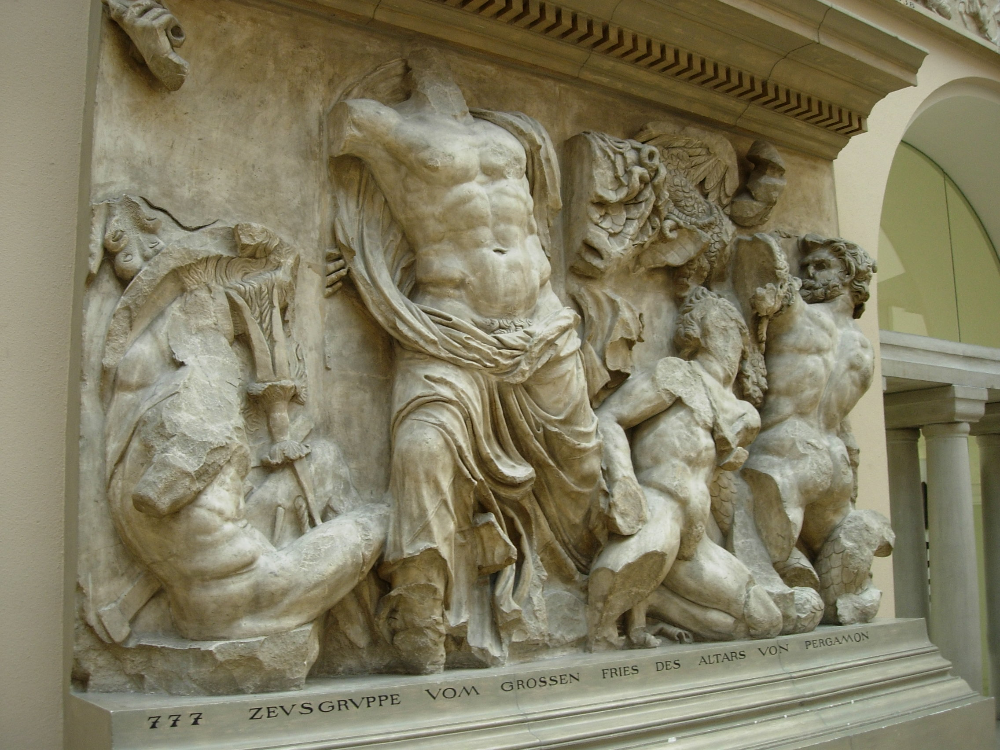 | 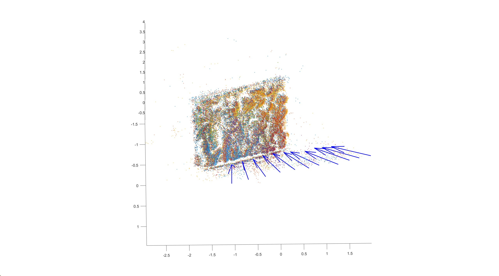 |
| 9 — Triceratops model | 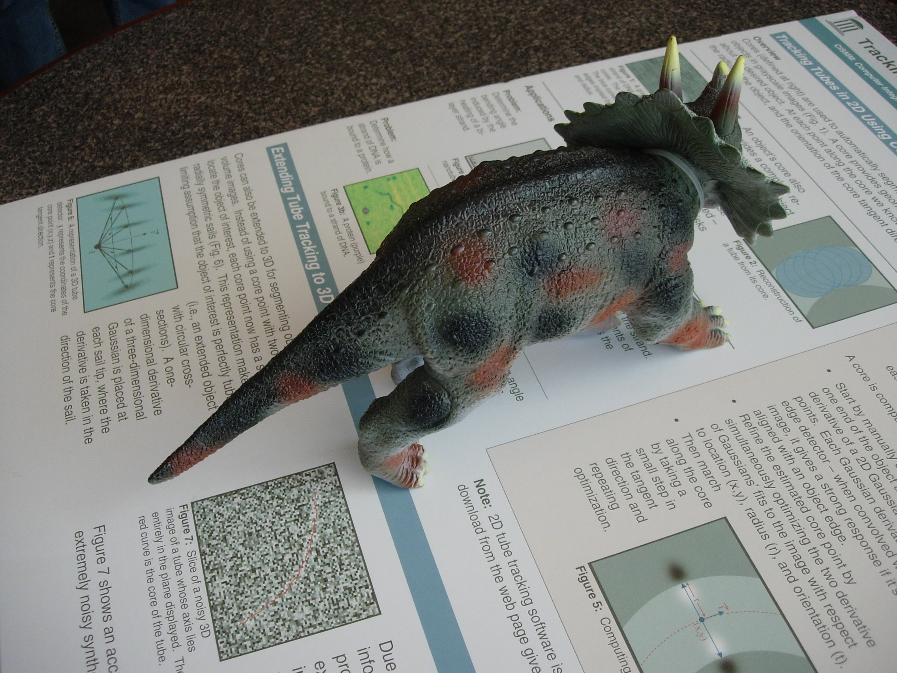 | 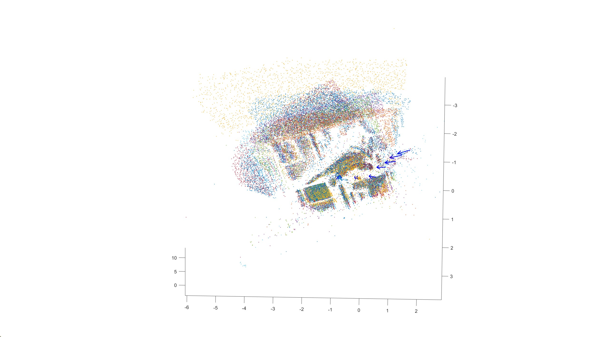 |

Datasets 1–5 have relatively little lens distortion and no dominant scene plane. Datasets 6–9 are harder because the scenes are close to planar and the camera has greater lens distortion.

## Included datasets

| ID | Scene | Image files | Resolution | 35 mm focal length | Initialization pair |
|---:|---|---:|---:|---:|---:|
| 1 | Kronan | 2 | 1936 × 1296 | 45 mm | 1, 2 |
| 2 | Courtyard corner | 9 | 1936 × 1296 | 43 mm | 1, 9 |
| 3 | Cathedral gate | 12 | 1936 × 1296 | 43 mm | 5, 8 |
| 4 | Fountain | 14 | 1936 × 1296 | 43 mm | 5, 10 |
| 5 | Golden statue | 10 | 1936 × 1296 | 45 mm | 3, 7 |
| 6 | Landhaus detail | 8 | 2272 × 1704 | 38 mm | 2, 4 |
| 7 | Heidelberg building | 7 | 2272 × 1704 | 38 mm | 1, 7 |
| 8 | Relief | 12 included (11 configured) | 2272 × 1704 | 38 mm | 4, 7 |
| 9 | Triceratops model | 11 included (9 configured) | 2272 × 1704 | 38 mm | 4, 6 |

## Requirements

- MATLAB with Image Processing Toolbox functionality (`rgb2gray`)
- [VLFeat](https://www.vlfeat.org/) for `vl_sift` and `vl_ubcmatch`

## Running the reconstruction

1. Download VLFeat.
2. Either run VLFeat's `vl_setup.m` before this project, or point MATLAB to the VLFeat installation:

   ```matlab
   setenv('VLFEAT_ROOT', 'C:\path\to\vlfeat');
   ```

3. Change MATLAB's current folder to the repository root.
4. Run a dataset by ID:

   ```matlab
   run_sfm(3)
   ```

   Alternatively, edit and run [`main.m`](main.m). The valid configured IDs are 1 through 9.

The script opens a MATLAB figure containing the reconstructed point cloud and camera poses. Because this is an unscaled monocular reconstruction, its coordinate system and overall scale are arbitrary.

## Code map

- `run_sfm.m` — orchestrates the full reconstruction.
- `get_dataset_info.m` — image lists, calibration values, initialization pairs, and thresholds.
- `extract_features.m`, `sift_points.m` — feature extraction and matching.
- `estimate_R_parallel.m` — robust essential-matrix/homography estimation and relative-pose selection.
- `compute_relative_rotations.m`, `calculate_absolute_rotations.m` — rotation chaining.
- `construct_3d_points_refined.m` — initial pair reconstruction and point refinement.
- `compute_camera.m`, `estimate_T_robust_2p_new.m`, `refine_P.m` — camera translation estimation and refinement.
- `triangulate_3D_point_DLT.m`, `triangulating_all_pairs.m` — linear triangulation and outlier filtering.
- `plotcams.m` — camera-pose visualization.

## Notes and limitations

- The implementation assumes known camera intrinsics derived from EXIF-equivalent focal length rather than performing self-calibration.
- Lens distortion is not explicitly corrected, so the nearly planar datasets 6–9 are more challenging.
- Feature tracks are formed from pairwise matches rather than a global track graph, and the final model is assembled from adjacent-pair triangulations.
- Refinement optimizes individual points and camera translations; it is not a joint full bundle adjustment over all camera and point parameters.
